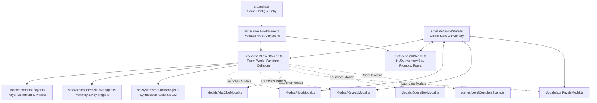

# 📁 Project Files & Architecture Overview

Welcome to **The Journey to Bappa (Level 1: The Bedroom)** codebase! This document provides a complete, easy-to-read reference of all files in this project, explaining what each file is responsible for, what classes or functions it contains, and how they connect with one another.

---

## 🗺️ High-Level Architecture

The game is built with **Phaser 4** and **TypeScript**, bundled with **Vite**. It follows a modular scene and component architecture:



---

## 📂 Directory Structure

```
Game-1/
├── docs/                             # Documentation folder
│   ├── FILES_OVERVIEW.md             # This file: explanation of every file
│   └── CUSTOMIZATION_GUIDE.md        # Guide on how to customize character, furniture, speed, etc.
├── public/                           # Static assets served directly by Vite
│   └── assets/
│       ├── items/                    # Inventory items (key, screwdriver, handle, artifact)
│       ├── player/                   # Character directional sprites & walk frames
│       ├── puzzles/                  # Note parchment, keypad, puzzle boxes
│       └── room/                     # Floor, bed, table, cupboard, drawer, mat
├── scripts/
│   └── process_assets.py             # Python script for transparent asset preparation
├── src/
│   ├── components/                   # Reusable game object entities
│   │   ├── Interactable.ts           # Click/press interactive zones
│   │   └── Player.ts                 # Controllable player sprite and mechanics
│   ├── scenes/                       # Phaser scene stages
│   │   ├── BootScene.ts              # Preloading assets & animations
│   │   ├── Level1Scene.ts            # The main bedroom world scene
│   │   ├── LevelCompleteScene.ts     # Victory celebration screen
│   │   ├── UIScene.ts                # Floating HUD, inventory, prompts, toasts
│   │   └── Modals/                   # Overlay mini-game & inspection popup scenes
│   │       ├── IconPuzzleModal.ts    # 4-Icon rotating puzzle box
│   │       ├── KeypadModal.ts        # Cupboard 3-digit numeric code entry
│   │       ├── MatClueModal.ts       # Floor carpet clue inspection
│   │       ├── NoteModal.ts          # Study desk clue note inspection
│   │       └── OpendBoxModal.ts      # Unlocked puzzle box inspection
│   ├── state/                        # Game state management
│   │   ├── GameState.ts              # Central reactive inventory & puzzle state
│   │   └── Types.ts                  # TypeScript interfaces and item definitions
│   ├── systems/                      # Utility and helper systems
│   │   ├── InteractionManager.ts     # Proximity detection & [E] interaction handler
│   │   └── SoundManager.ts           # Web Audio API procedural sound effects & BGM
│   ├── main.ts                       # Phaser game bootstrap configuration
│   ├── style.css                     # Global canvas styling and typography
│   └── vite-env.d.ts                 # Vite client environment typing
├── index.html                        # Main HTML wrapper container
├── package.json                      # NPM dependencies and scripts
├── tsconfig.json                     # TypeScript compiler configuration
└── vite.config.ts                    # Vite build tool configuration
```

---

## 📄 File Details: Root & Build Configuration

| File | Purpose | Key Contents |
| :--- | :--- | :--- |
| [`index.html`](file:///Work/Main-computer/Game-1/index.html) | Main HTML container for the browser. | Mounts `#game-container`, loads Google Fonts (*Cinzel* & *Outfit*), and links to `src/main.ts`. |
| [`package.json`](file:///Work/Main-computer/Game-1/package.json) | NPM project definition and dependencies. | Declares dependencies (`phaser`), devDependencies (`typescript`, `vite`), and npm commands (`dev`, `build`, `preview`). |
| [`tsconfig.json`](file:///Work/Main-computer/Game-1/tsconfig.json) | TypeScript compiler options. | Specifies target ECMAScript version, module resolution, and strict typing rules. |
| [`vite.config.ts`](file:///Work/Main-computer/Game-1/vite.config.ts) | Vite bundler configuration. | Configures development server port, static asset base path, and build output settings. |

---

## 📄 File Details: Source Code (`src/`)

### 1. Main Entry Points
| File | Purpose | Description |
| :--- | :--- | :--- |
| [`src/main.ts`](file:///Work/Main-computer/Game-1/src/main.ts) | **Game Bootstrap & Config** | Configures canvas size (`1024x768`), physics engine (Arcade Physics with zero gravity), scaling mode (`FIT`, `CENTER_BOTH`), and registers all scenes. |
| [`src/style.css`](file:///Work/Main-computer/Game-1/src/style.css) | **Global CSS Styling** | Removes browser scrollbars, centers `#game-container`, and styles the background canvas frame. |
| [`src/vite-env.d.ts`](file:///Work/Main-computer/Game-1/src/vite-env.d.ts) | **Vite Types** | Standard TypeScript ambient definitions for Vite client imports. |

---

### 2. Components (`src/components/`)
| File | Purpose | Description |
| :--- | :--- | :--- |
| [`src/components/Player.ts`](file:///Work/Main-computer/Game-1/src/components/Player.ts) | **Player Character Sprite** | Extends `Phaser.Physics.Arcade.Sprite`. Handles 8-direction keyboard input (Arrow Keys + WASD), player scale, footstep timing, walking sway animation, physics body size at feet, and dynamic Y-depth sorting. |
| [`src/components/Interactable.ts`](file:///Work/Main-computer/Game-1/src/components/Interactable.ts) | **Interactable Zone Definition** | Encapsulates an interactive point in world space with coordinates `(x, y)`, an active trigger `radius`, a UI prompt text (e.g. `[E] Examine Note`), and an `onInteract` callback. |

---

### 3. Scenes (`src/scenes/`)
| File | Purpose | Description |
| :--- | :--- | :--- |
| [`src/scenes/BootScene.ts`](file:///Work/Main-computer/Game-1/src/scenes/BootScene.ts) | **Preloader & Animation Setup** | Displays an Indian temple-themed loading bar, preloads all images from `public/assets/`, registers directional walking animations (`walk_up`, `walk_down`, `walk_left`, `walk_right`), then boots `Level1Scene` and `UIScene`. |
| [`src/scenes/Level1Scene.ts`](file:///Work/Main-computer/Game-1/src/scenes/Level1Scene.ts) | **Main Bedroom World** | Spawns the room floor, places all furniture (bed, carpet mat, desk, almirah cupboard, bedside drawer, wall panel, door), configures collision boundary obstacles, initializes player spawn, and registers all interactive world objects. |
| [`src/scenes/UIScene.ts`](file:///Work/Main-computer/Game-1/src/scenes/UIScene.ts) | **Heads-Up Display (HUD)** | Renders the top objective bar, bottom inventory item slots, dynamic `[E]` interaction tooltips, temporary banner toast notifications, and controls helper guide. |
| [`src/scenes/LevelCompleteScene.ts`](file:///Work/Main-computer/Game-1/src/scenes/LevelCompleteScene.ts) | **Victory & Summary Screen** | Displays completion celebratory screen when player unlocks the bedroom door and escapes. Shows time taken, artifacts collected, and allows restarting or proceeding. |

---

### 4. Interactive Modals (`src/scenes/Modals/`)
| File | Purpose | Description |
| :--- | :--- | :--- |
| [`src/scenes/Modals/NoteModal.ts`](file:///Work/Main-computer/Game-1/src/scenes/Modals/NoteModal.ts) | **Study Desk Note Viewer** | Displays an illuminated close-up modal of the parchment note with sacred Sanskrit/temple lore providing the clue for the cupboard keypad (`372`). |
| [`src/scenes/Modals/KeypadModal.ts`](file:///Work/Main-computer/Game-1/src/scenes/Modals/KeypadModal.ts) | **Locker Keypad Puzzle** | An interactive numeric keypad overlay on the cupboard. Entering `372` unlocks the locker and grants the `Almirah_Handle`. |
| [`src/scenes/Modals/MatClueModal.ts`](file:///Work/Main-computer/Game-1/src/scenes/Modals/MatClueModal.ts) | **Carpet Mat Clue Inspection** | Displays an enlarged close-up of the bed mat revealing the celestial symbol order (Lotus, Conch, Om, Gada/Mace) used to unlock the puzzle box. |
| [`src/scenes/Modals/IconPuzzleModal.ts`](file:///Work/Main-computer/Game-1/src/scenes/Modals/IconPuzzleModal.ts) | **4-Icon Rotating Puzzle Box** | Four rotating stone dials found inside the almirah. Clicking dials cycles sacred Indian symbols. Aligning them in the correct sequence unlocks the box and yields `Key 1`. |
| [`src/scenes/Modals/OpendBoxModal.ts`](file:///Work/Main-computer/Game-1/src/scenes/Modals/OpendBoxModal.ts) | **Opened Box Modal** | Shows the interior of the solved puzzle box with its unlocked compartment. |

---

### 5. Game State & Systems (`src/state/` & `src/systems/`)
| File | Purpose | Description |
| :--- | :--- | :--- |
| [`src/state/GameState.ts`](file:///Work/Main-computer/Game-1/src/state/GameState.ts) | **Single Source of Truth** | A singleton state manager tracking player inventory, solved puzzle flags, and dynamic mission objectives with subscription callbacks for reactive UI updates. |
| [`src/state/Types.ts`](file:///Work/Main-computer/Game-1/src/state/Types.ts) | **Type Definitions & Item Registry** | Defines item types (`Almirah_Handle`, `Key_1`, `Screwdriver`, `Bedroom_Door_Key`, `Artefact_Fragment`) and metadata (names, icons, descriptions). |
| [`src/systems/InteractionManager.ts`](file:///Work/Main-computer/Game-1/src/systems/InteractionManager.ts) | **Proximity Interaction System** | Scans registered interactables each frame, finds the nearest item within trigger radius, updates prompts, and handles the `E` and `Space` key presses. |
| [`src/systems/SoundManager.ts`](file:///Work/Main-computer/Game-1/src/systems/SoundManager.ts) | **Procedural Audio Engine** | Uses the browser's Web Audio API to procedurally synthesize footsteps, mechanical drawer sounds, door unlocks, chimes, item pickup SFX, and soothing meditative ambient background drone music without external audio files. |

---

### 6. Tools & Asset Processing (`scripts/`)
| File | Purpose | Description |
| :--- | :--- | :--- |
| [`scripts/process_assets.py`](file:///Work/Main-computer/Game-1/scripts/process_assets.py) | **Asset Extraction Script** | Python script utilizing Pillow (PIL) to perform flood-fill background removal and crop transparent PNG sprites from source art in `project-1/asset/` into `public/assets/`. |

---

## 🔁 Complete Puzzle Flow in Level 1

1. **Desk Note**: Inspect study desk note -> Learns clue for code `372`.
2. **Cupboard Locker**: Enter `372` on keypad -> Receive `Almirah Handle`.
3. **Almirah Doors**: Use `Almirah Handle` on cupboard -> Reveals locked 4-Icon Puzzle Box.
4. **Bedside Mat**: Inspect mat beside bed -> Learns 4-icon sequence.
5. **Puzzle Box**: Align 4 rotating symbols -> Unlocks box to get `Key 1`.
6. **Bedside Drawer**: Use `Key 1` on locked drawer -> Collect `Screwdriver`.
7. **Screwed Wall Panel**: Use `Screwdriver` on metal wall panel -> Uncovers `Bedroom Door Key` and sacred `Artefact Fragment`.
8. **Bedroom Door**: Use `Bedroom Door Key` on top door -> Unlocks door and triggers `LevelCompleteScene`!
