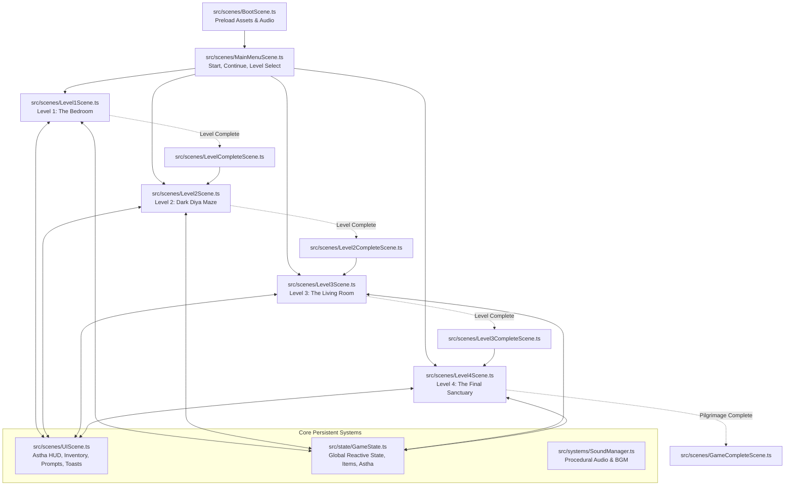

# 📁 The Journey to Bappa — Complete Codebase Architecture & File Reference

Welcome to **The Journey to Bappa** full game codebase. This reference describes the end-to-end multi-level architecture, state machine, asset hierarchy, scenes, modals, collision systems, and sound engine across all 4 levels.

---

## 🗺️ High-Level Architecture Overview

The game is built with **Phaser 3.80+ / Phaser 4**, **TypeScript**, and bundled via **Vite**. The runtime operates on a multi-scene architecture where gameplay levels run concurrently with a permanent HUD/UI scene and reactive overlay modals:



---

## 📂 Project Directory Map

```
Game-1/
├── docs/                             # Developer & Designer Documentation
│   ├── CUSTOMIZATION_GUIDE.md        # Step-by-step instructions to adjust speeds, hitboxes, codes, items
│   ├── FILES_OVERVIEW.md             # This file: Comprehensive file directory & architecture
│   └── LEVEL_DESIGN_SPECS.md         # Narrative, puzzle flows, passwords & Astha mechanics per level
├── public/
│   └── assets/
│       ├── audio/                    # Background music and ambience
│       ├── items/                    # Inventory icons (artefact fragments, diya, keys, screwdrivers)
│       ├── level1/                   # Bedroom backgrounds, furniture, clues
│       ├── level2/                   # Maze map (maze.png), fog shaders, vighna shadow sprites
│       ├── level3/                   # Living room background (Living_Room.png), paintings, sofa, piano
│       ├── level4/                   # Sanctuary room background, altar, seals, lotus glyphs
│       ├── player/                   # 4-directional player character spritesheets
│       └── puzzles/                  # In-world puzzles, keypad panels, parchment notes
├── src/
│   ├── components/                   # Reusable arcade components
│   │   ├── Interactable.ts           # Proximity-based interaction trigger zones
│   │   └── Player.ts                 # Controllable 2.5D character with foot collision body
│   ├── scenes/                       # Game scenes (Levels, Overlays, Endings)
│   │   ├── BootScene.ts              # Preloads all audio, sprites, textures, and fonts
│   │   ├── MainMenuScene.ts          # Title screen, continue button, audio toggles
│   │   ├── Level1Scene.ts            # Level 1 Bedroom gameplay
│   │   ├── Level1Walls.ts            # Bedroom static wall boundaries
│   │   ├── LevelCompleteScene.ts     # Level 1 victory screen
│   │   ├── Level2Scene.ts            # Level 2 Dark Diya Maze with dynamic fog & shadows
│   │   ├── Level2Walls.ts            # Pixel-accurate static collision geometry for maze & idols
│   │   ├── Level2CompleteScene.ts    # Level 2 victory celebration & Astha recap
│   │   ├── Level3Scene.ts            # Level 3 Living Room with Morse code clues
│   │   ├── Level3Walls.ts            # Living Room boundaries and furniture hitboxes
│   │   ├── Level3CompleteScene.ts    # Level 3 victory & complete artefact fusion recap
│   │   ├── Level4Scene.ts            # Level 4 Final Temple Sanctuary with image dial mechanism
│   │   ├── GameCompleteScene.ts      # Grand ending cinematic & story outro
│   │   ├── UIScene.ts                # Permanent HUD (Astha counter, Inventory bar, [E] prompt)
│   │   └── Modals/                   # Interactive pop-up puzzles and inspections
│   │       ├── PauseModal.ts         # In-game pause menu with sound settings & hints viewer
│   │       ├── DivineHintModal.ts    # Sacred 5-second hint modal showing unlocked pilgrimage seals
│   │       ├── MorseChartModal.ts    # Complete International Morse Code Reference (A-Z & 0-9)
│   │       ├── KeypadModal.ts        # Level 1 cupboard numeric code entry
│   │       ├── NoteModal.ts          # Level 1 desk note inspection
│   │       ├── MatClueModal.ts       # Level 1 rug pattern inspection
│   │       ├── IconPuzzleModal.ts    # Level 1 rotating 4-symbol lockbox
│   │       ├── OpendBoxModal.ts      # Level 1 unlocked box inspection
│   │       ├── Level3CloseupModal.ts # Level 3 close-up inspector for furniture & paintings
│   │       ├── ArtefactBoxModal.ts   # Level 3 secret locker with virtual keyboard (SHIV code)
│   │       ├── Level3DoorKeypadModal.ts # Level 3 exit door keypad (9277 code)
│   │       └── Level4ImagePuzzleModal.ts # Level 4 image mechanism with 8 seals
│   ├── state/                        # Reactive game state
│   │   ├── GameState.ts              # Central reactive store (inventory, level state, Astha points)
│   │   └── Types.ts                  # TypeScript types, interfaces, and ITEM_REGISTRY definitions
│   ├── systems/                      # Gameplay subsystem engines
│   │   ├── InteractionManager.ts     # Proximity testing and prompt dispatching
│   │   └── SoundManager.ts           # Procedural Web Audio API sound synthesizer and BGM
│   ├── main.ts                       # Phaser bootstrap config and scene registration
│   └── style.css                     # Canvas styling, typography, and viewport centering
├── .gitignore                        # Git exclusion rules
├── index.html                        # Browser entry HTML
├── package.json                      # Build scripts and dependencies
├── tsconfig.json                     # TypeScript compiler configuration
└── vite.config.ts                    # Vite build tool configuration
```

---

## 📜 Scene Responsibility Breakdown

### 1. Preload & Menus
- **[`BootScene.ts`](file:///Work/Main-computer/Game-1/src/scenes/BootScene.ts)**:
  - Preloads textures, spritesheets, UI icons, and audio.
  - Automatically initializes and transitions to `MainMenuScene`.
- **[`MainMenuScene.ts`](file:///Work/Main-computer/Game-1/src/scenes/MainMenuScene.ts)**:
  - Title banner with glowing particles.
  - Buttons: `Play Game`, `Continue`, `Level Select`, `Settings / Audio`.

### 2. Gameplay Level Scenes
- **[`Level1Scene.ts`](file:///Work/Main-computer/Game-1/src/scenes/Level1Scene.ts)**:
  - **Setting**: The child's bedroom.
  - **Objectives**: Find note, unlock cupboard (`372`), solve mat clue, unlock 4-icon box (`Lotus, Conch, Om, Mace`), obtain `Artefact_Fragment` and bedroom key to exit.
  - **Astha**: Praying to Bappa's portrait awards **+20 Astha** and reveals Hint 1 (`ELEPHANT`).
- **[`Level2Scene.ts`](file:///Work/Main-computer/Game-1/src/scenes/Level2Scene.ts)**:
  - **Setting**: Dark Diya Forest Maze with moving Vighna shadows.
  - **Mechanics**: Pick up Diya, maintain oil/light, avoid shadows.
  - **Astha & Hitboxes**: 3 sacred Bappa idols (NW, SW, SE) have solid physical obstacle bodies. Praying before idols grants Astha (+10 for first idol, which unlocks Hint 2 `DIYA`, and +5 each for the other two idols, reaching **40 Astha**).
- **[`Level3Scene.ts`](file:///Work/Main-computer/Game-1/src/scenes/Level3Scene.ts)**:
  - **Setting**: The quiet living room with antique furniture and portraits.
  - **Mechanics**: Examine sofa, piano, laptop, and cupboard to discover Morse whispers.
  - **Morse Reference**: In-world Morse chart interactable opens [`MorseChartModal.ts`](file:///Work/Main-computer/Game-1/src/scenes/Modals/MorseChartModal.ts) showing all letters (A-Z) and numbers (0-9).
  - **Puzzles**: Secret locker unlocked with word `SHIV` awards `Artefact_Fragment_2` and combines into `Completed_Artefact` (+10 Astha, reaching **50 Astha**, unlocking Hint 3 `TRIDENT`). Door keypad unlocked with `9277` (Morse from portraits).
- **[`Level4Scene.ts`](file:///Work/Main-computer/Game-1/src/scenes/Level4Scene.ts)**:
  - **Setting**: Sacred Temple Sanctuary.
  - **Mechanics**: Solid hitboxes on central pedestal and Lord Ganesha idol prevent walking/climbing on them.
  - **Astha & Revelation**: Praying before Ganesha's idol grants **+50 Astha** (reaching **100/100 Astha**) and reveals Hint 4 (`TEMPLE`) along with the full pilgrimage sequence:
    `1. Elephant ➔ 2. Diya ➔ 3. Trident ➔ 4. Temple`.
  - **Mechanism**: Insert `Completed_Artefact` into pedestal, tap the 4 symbols in sequence, open the golden sanctum portal, and walk into Bappa's light.

### 3. Victory & Completion Scenes
- **[`LevelCompleteScene.ts`](file:///Work/Main-computer/Game-1/src/scenes/LevelCompleteScene.ts)**: Level 1 recap.
- **[`Level2CompleteScene.ts`](file:///Work/Main-computer/Game-1/src/scenes/Level2CompleteScene.ts)**: Level 2 recap with Diya showcase.
- **[`Level3CompleteScene.ts`](file:///Work/Main-computer/Game-1/src/scenes/Level3CompleteScene.ts)**: Level 3 recap with seal readiness summary.
- **[`GameCompleteScene.ts`](file:///Work/Main-computer/Game-1/src/scenes/GameCompleteScene.ts)**: Cinematic ending cutscene and replay options.

### 4. Modals & Overlay Scenes
- **[`UIScene.ts`](file:///Work/Main-computer/Game-1/src/scenes/UIScene.ts)**: Top-left Astha badge (clickable to view hints), top objective banner, bottom inventory dock, interaction prompt tooltip, toast notifications.
- **[`PauseModal.ts`](file:///Work/Main-computer/Game-1/src/scenes/Modals/PauseModal.ts)**: Resume, Restart Level, Divine Hints viewer, Sound Mute toggle, and Main Menu.
- **[`DivineHintModal.ts`](file:///Work/Main-computer/Game-1/src/scenes/Modals/DivineHintModal.ts)**: Displays all discovered pilgrimage seals with automated 5-second countdown timer and close button.
- **[`MorseChartModal.ts`](file:///Work/Main-computer/Game-1/src/scenes/Modals/MorseChartModal.ts)**: Clean, non-spoiling reference sheet for International Morse Code.
- **[`Level4ImagePuzzleModal.ts`](file:///Work/Main-computer/Game-1/src/scenes/Modals/Level4ImagePuzzleModal.ts)**: 8 pure image seals without written spoilers; includes `[UNDO]`, `[RESET]`, and `[HINTS]` controls.

---

## 🗄️ State Management Architecture (`src/state/GameState.ts`)

`GameState` is a singleton store implementing the **Observer Pattern**. Any change to inventory, Astha points, or puzzle flags immediately notifies `UIScene` and active level scenes.

```typescript
// Subscribing to changes:
const unsubscribe = GameState.subscribe(() => {
  // Update HUD or scene visuals
});

// Adding Astha:
GameState.addAstha(10); // Automatically triggers HUD animation and audio cue

// Checking hints:
GameState.isHintUnlocked(2); // true if player has unlocked Seal 2 (Diya)
```

---

## 🔊 Procedural Audio Engine (`src/systems/SoundManager.ts`)

All sound effects and ambient soundtracks are procedurally synthesized using the browser's native **Web Audio API** (`AudioContext`). This ensures:
- Zero audio loading lag.
- No missing sound asset files.
- Crisp, dynamic chime pitches for Astha gains, puzzle triumphs, door unlocks, and footsteps.
